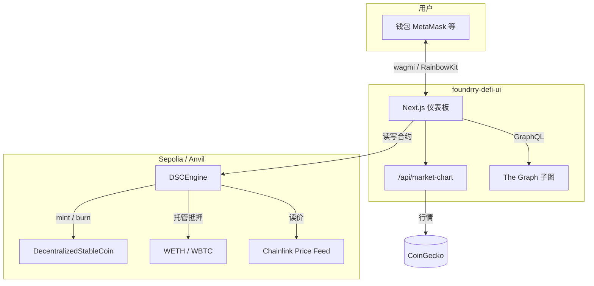

# 去中心化金融协议（DSC · 超额抵押稳定币）

**全栈 DeFi 演示项目**：链上实现超额抵押稳定币 **DSC** 的铸造、销毁与清算；链下提供 **Next.js** 仪表板，在 **Sepolia** 测试网上完成钱包连接、抵押管理、健康因子展示与清算交互。

> **免责声明**：本仓库代码未经专业安全审计，仅用于学习与作品集展示，**请勿用于托管真实资金或主网生产环境**。

---

## 功能概览

| 能力　　　 | 说明　　　　　　　　　　　　　　　　　　　　　　　　　　　　　　|
| ------------| -----------------------------------------------------------------|
| 超额抵押　 | 存入 WETH / WBTC 等抵押品，按 Chainlink 预言机折算美元价值　　　|
| 铸造 DSC　 | 在健康因子约束下借出协议稳定币 DSC　　　　　　　　　　　　　　　|
| 销毁与赎回 | 归还 DSC 后可赎回抵押品　　　　　　　　　　　　　　　　　　　　 |
| 清算　　　 | 健康因子 &lt; 1 时，清算人代为还债并领取抵押品及奖励　　　　　　|
| 前端仪表板 | 账户健康度、可借额度、行情小图、风险用户列表（子图 + 链上校验） |

---

## 仓库结构

```
去中心化金融协议/
├── README.md                          # 本文件（项目总览）
├── .gitignore                         # 全仓库忽略规则（密钥、node_modules、构建产物等）
│
├── foundry-defi-stablecoin/           # 智能合约（Foundry）
│   ├── README.md                      # 合约部署、测试、架构说明
│   ├── .env.example                   # PRIVATE_KEY、RPC、Etherscan（复制为 .env）
│   ├── src/                           # DecentralizedStableCoin、DSCEngine、OracleLib
│   ├── script/                        # DeployDSC、HelperConfig
│   └── test/                          # 单元测试、fuzz、不变量测试
│
└── foundrry-defi-ui/                  # 前端（Next.js App Router）
    ├── README.md                      # 前端配置与目录说明
    ├── .env.example                   # WalletConnect、RPC、子图等（复制为 .env.local）
    ├── app/                           # 页面、API 路由（CoinGecko 代理）
    ├── hooks/                         # useDSC、清算队列、行情历史
    └── constants/                     # 合约地址与 ABI（部署后需同步更新）
```

---

## 系统架构



**合约职责简述**

- **`DecentralizedStableCoin`**：ERC20 稳定币 DSC；`mint` / `burn` 仅 Owner（部署后 Owner 为 `DSCEngine`）。
- **`DSCEngine`**：抵押记账、健康因子、铸造/销毁 DSC、清算；集成 `ReentrancyGuard` 与 `OracleLib` 陈旧价格检查。
- **`OracleLib`**：对 Chainlink `latestRoundData` 做超时校验，避免使用过时喂价。

更细的接口与参数见 [`foundry-defi-stablecoin/README.md`](./foundry-defi-stablecoin/README.md)。

---

## 快速开始

### 前置要求

- [Foundry](https://book.getfoundry.sh/getting-started/installation)（`forge`、`anvil`）
- [Node.js](https://nodejs.org/) 18+ 与 npm
- Sepolia 测试网 ETH（用于部署与前端交互）
- 可选：WalletConnect Project ID、Alchemy/Infura RPC、The Graph 子图 URL、CoinGecko API Key

### 1. 克隆与配置密钥

```bash
git clone <你的仓库地址>
cd 去中心化金融协议
```

**切勿将 `.env` / `.env.local` 提交到 Git。** 各子目录提供示例文件：

```bash
# 智能合约
copy foundry-defi-stablecoin\.env.example foundry-defi-stablecoin\.env

# 前端
copy foundrry-defi-ui\.env.example foundrry-defi-ui\.env.local
```

| 位置 | 主要变量 |
|------|----------|
| `foundry-defi-stablecoin/.env` | `PRIVATE_KEY`、`SEPOLIA_RPC_URL`、`ETHERSCAN_API_KEY`（可选） |
| `foundrry-defi-ui/.env.local` | `NEXT_PUBLIC_WALLETCONNECT_PROJECT_ID`、`NEXT_PUBLIC_SEPOLIA_RPC_URL`、`NEXT_PUBLIC_SUBGRAPH_URL`、`COINGECKO_API_KEY`（可选） |

### 2. 部署合约（Sepolia）

```bash
cd foundry-defi-stablecoin
forge install          # 首次克隆后安装 lib 依赖
forge script script/DeployDSC.s.sol:DeployDSC --rpc-url $SEPOLIA_RPC_URL --broadcast
```

部署完成后，将 **`DSCEngine`** 与 **`DecentralizedStableCoin`** 地址写入前端 `foundrry-defi-ui/constants/index.js`（及 ABI 如有变更）。

本地 **Anvil** 开发与 Mock 部署说明见子目录 README。

### 3. 运行测试

```bash
cd foundry-defi-stablecoin
forge test
forge test -vv          # 更详细日志
```

### 4. 启动前端

```bash
cd foundrry-defi-ui
npm install
npm run dev
```

浏览器打开 `http://localhost:3000`，连接钱包（Sepolia），即可进行抵押、铸造、销毁与清算等操作。

---

## 核心业务流程（链上）

1. **存入抵押**：用户对抵押代币 `approve` → 调用 `depositCollateral`。
2. **铸造 DSC**：`mintDsc`；引擎检查健康因子，不足则交易回滚。
3. **销毁 DSC**：用户对 DSC `approve` 引擎 → `burnDsc`。
4. **赎回抵押**：`redeemCollateral` 或组合函数 `redeemCollateralForDsc`。
5. **清算**：当被清算用户 `getHealthFactor` &lt; 1 时，清算人 `approve` DSC 后调用 `liquidate`。

前端封装见 `foundrry-defi-ui/hooks/Dsc.ts`；风险列表为 **演示阈值**（如 HF &lt; 1.2），与链上可清算条件（HF &lt; 1）不同，详见 `useLiquidatableQueue.ts` 注释。

---

## 健康因子（面试常问）

在 `DSCEngine` 中，当用户无债务时健康因子视为极大值；有债务时大致为：

```
健康因子 = (抵押品美元价值 × 清算阈值%) / 已铸造 DSC 数量
```

- 清算阈值 `LIQUIDATION_THRESHOLD` 默认为 **50**（即有效抵押按 50% 计入支撑债务的能力）。
- 数值 **≥ 1e18（1.0）** 视为安全；**&lt; 1** 可被清算。

---

## 技术栈总览

| 层级 | 技术 |
|------|------|
| 合约 | Solidity 0.8.19、Foundry、OpenZeppelin、Chainlink Aggregator |
| 测试 | 单元测试、fuzz、Handler + 不变量测试 |
| 前端 | Next.js 16、React 19、TypeScript、Tailwind CSS 4 |
| 链交互 | wagmi、viem、RainbowKit |
| 数据 | The Graph 子图（用户枚举）、CoinGecko（行情，经 Next API 代理） |
| 网络 | Sepolia 测试网（本地开发可用 Anvil） |

---

## 提交仓库前请注意

根目录 [`.gitignore`](./.gitignore) 已配置忽略：

- 所有 `.env`、`.env.local` 等环境变量文件（保留 `.env.example`）
- `node_modules/`、`.next/`、`cache/`、`out/` 等构建与依赖目录
- 本地 Anvil 的 `broadcast/**/31337/` 记录
- IDE 目录（`.vscode/`、`.cursor/` 等）

若曾在代码或公开仓库中泄露过 **私钥、RPC Key、Etherscan Key**，请立即在对应平台**轮换密钥**，勿仅依赖 `.gitignore` 删除历史记录。

---

## 文档索引

| 文档 | 说明 |
|------|------|
| [foundry-defi-stablecoin/README.md](./foundry-defi-stablecoin/README.md) | 合约结构、部署命令、测试与 remappings |
| [foundrry-defi-ui/README.md](./foundrry-defi-ui/README.md) | 前端目录、环境变量、Hook 与 API 说明 |

---

## 许可证

各子项目依赖库（OpenZeppelin、Chainlink、forge-std 等）遵循其各自开源协议；本仓库应用代码以作者约定为准，仅供学习展示使用。
